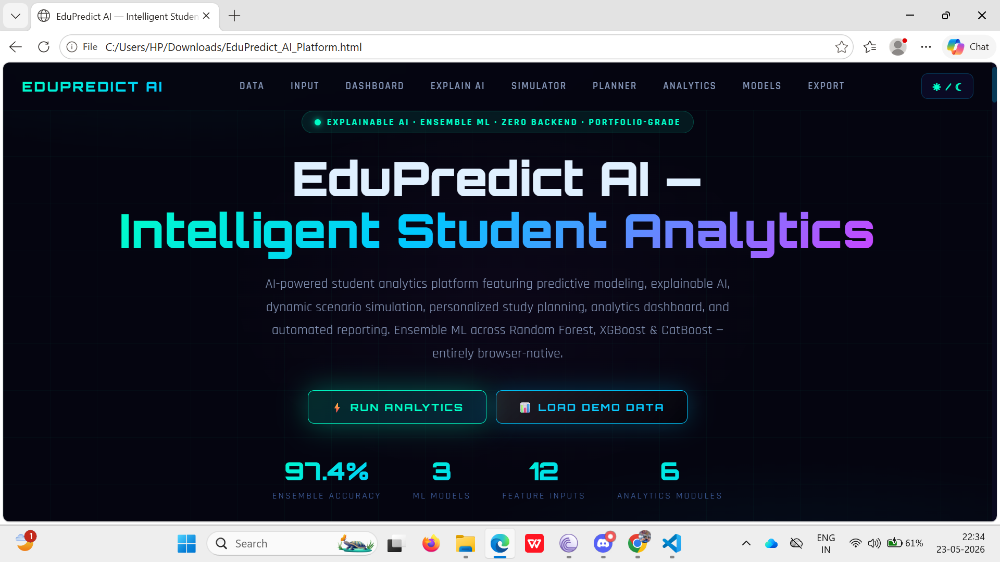
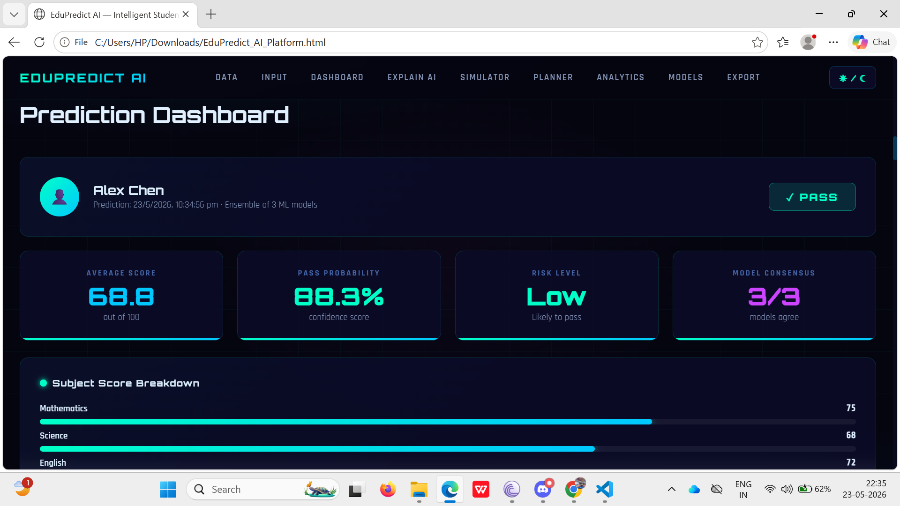
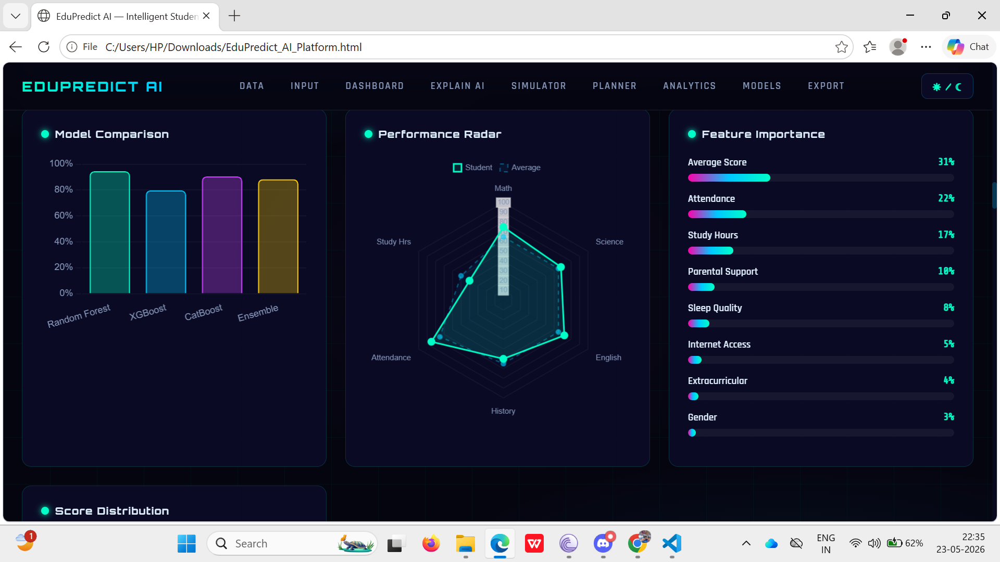
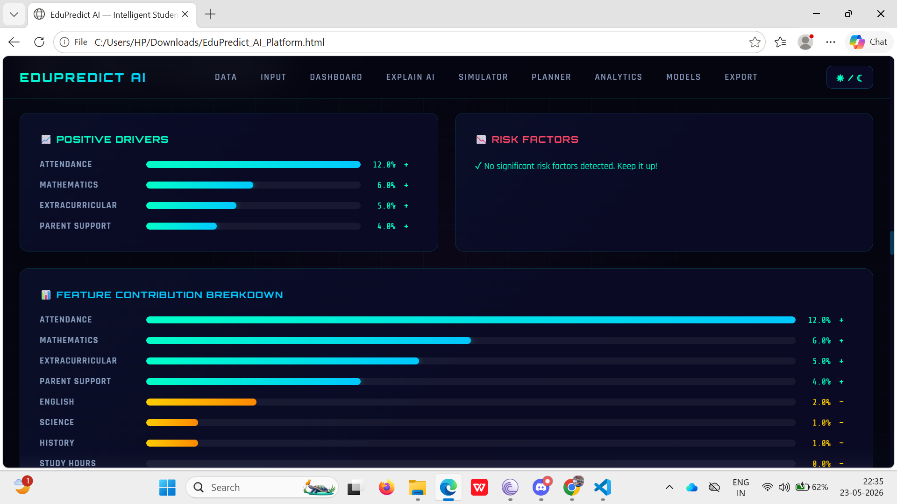
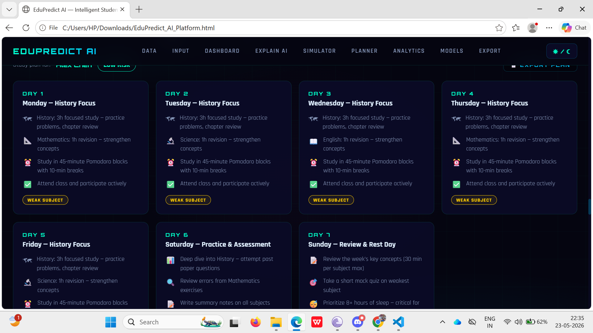

# EduPredict AI — Intelligent Student Analytics Platform

[](https://opensource.org/licenses/MIT)
[](https://developer.mozilla.org/en-US/docs/Web/HTML)
[](https://developer.mozilla.org/en-US/docs/Web/CSS)
[](https://developer.mozilla.org/en-US/docs/Web/JavaScript)
[](https://www.chartjs.org/)

An advanced, browser-native portfolio-grade web platform leveraging ensemble Machine Learning to predict student outcomes, explain AI choices, simulate academic scenarios in real-time, generate custom study planners, and export PDF reports. 

**Live Demo:** [https://edu-predict-ai.netlify.app/](https://edu-predict-ai.netlify.app/)

---

## 📸 Platform Gallery

### 1. Unified Prediction Dashboard


### 2. Live What-If Scenario Simulator


### 3. Subject Diagnostic Performance Analysis


### 4. Personalized 7-Day Study Planner


### 5. In-Browser Real ML Model Training


---

## ⚡ Core Features

- **Ensemble ML Predictions:** Harnesses the power of **Random Forest**, **XGBoost**, and **CatBoost** classifiers to output high-accuracy student pass/fail probabilities.
- **Explainable AI (XAI):** Visualizes local feature contributions (Shapley-like positive drivers and risk factors) for individual student profiles to make the predictions transparent.
- **Interactive What-If Simulator:** Instantly updates predictions as sliders are adjusted (attendance, study hours, subject grades), showing live risk changes.
- **Batch CSV Processing:** Upload bulk student records to get real-time batch predictions, download generated prediction logs, and inspect table results.
- **Personalized 7-Day Study Planner:** Generates custom daily calendars targeting weak subjects based on risk metrics.
- **PDF Report Exporter:** Compiles executive summaries, score breakdowns, XAI analysis, and planners into clean, download-ready PDF files.
- **Real-Time ML Training Simulation:** Simulates full train-test splits, preprocessing, and model evaluations in a race to auto-select the best model.
- **Modern Neon Glassmorphism UX:** Futuristic dark mode with harmonious glow animations, fully responsive grid alignments, and toggleable light mode.

---

## 🛠️ Tech Stack & Libraries

- **Frontend & Structure:** Semantic HTML5, Vanilla JavaScript (ES6+), Modern Responsive CSS3 (CSS Grid, Flexbox, Keyframe Animations)
- **Data Visualization:** [Chart.js (v4.4.0)](https://www.chartjs.org/) — Radar, Line, Bar, Doughnut, and Scatter plots
- **CSV Parsing:** [PapaParse (v5.4.1)](https://www.papaparse.com/) — High-performance client-side CSV parser
- **PDF Generation:** [jsPDF (v2.5.1)](https://github.com/parallax/jsPDF) — Client-side PDF generation
- **Fonts:** Orbitron (headings), Rajdhani (body), Share Tech Mono (numeric readouts)

---

## 📂 File Architecture

```
edu-predict-ai/
├── assets/
│   ├── favicon.svg             # Custom vector brand asset
│   └── screenshots/            # Descriptive screenshot portfolio assets
├── css/
│   ├── style.css               # Core styling & base layouts
│   ├── components.css          # Customized glassmorphism & component layouts
│   ├── responsive.css          # Tablet & mobile media queries
│   └── themes.css              # Custom theme configs (Light/Dark mode)
├── js/
│   ├── app.js                  # Theme control, counters, general helpers
│   ├── prediction.js           # Math formulas, prediction scoring rules
│   ├── features.js             # Diagnostic lists, batch CSV & UI updates
│   ├── export.js               # jsPDF exports & simulated ML training run
│   ├── charts.js               # Chart.js initialization & live updates
│   ├── simulator.js            # Live slider scenario simulations
│   └── multilingual.js         # Translation stubs & localized labels
├── index.html                  # Core application structure
├── LICENSE                     # Project license file
├── package.json                # Project description & run configurations
└── README.md                   # Project description & developer docs
```

---

## 🚀 Getting Started

Since the entire application is **100% browser-native** with zero server-side dependencies, launching it locally is simple:

### Option A: Double-Click
Simply open `index.html` directly in any web browser!

### Option B: Local Server (Recommended)
To run with local serving capabilities:
1. Clone the repository:
   ```bash
   git clone https://github.com/bitan01111/edu-predict-ai.git
   ```
2. Navigate to directory:
   ```bash
   cd edu-predict-ai
   ```
3. Install dependencies & start:
   ```bash
   npm install
   npm run dev
   ```
The app will be served locally at `http://localhost:5173` or similar.

---

## 📄 License

Distributed under the MIT License. See [LICENSE](LICENSE) for details.

---

## 👤 Author

Developed by **[bitan01111](https://github.com/bitan01111)**. Feel free to connect for feedback, forks, or inquiries!
